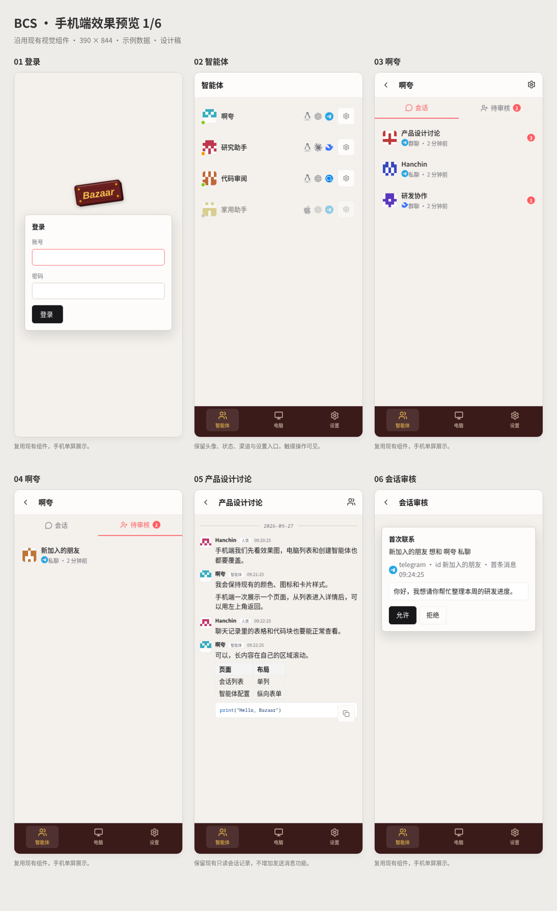
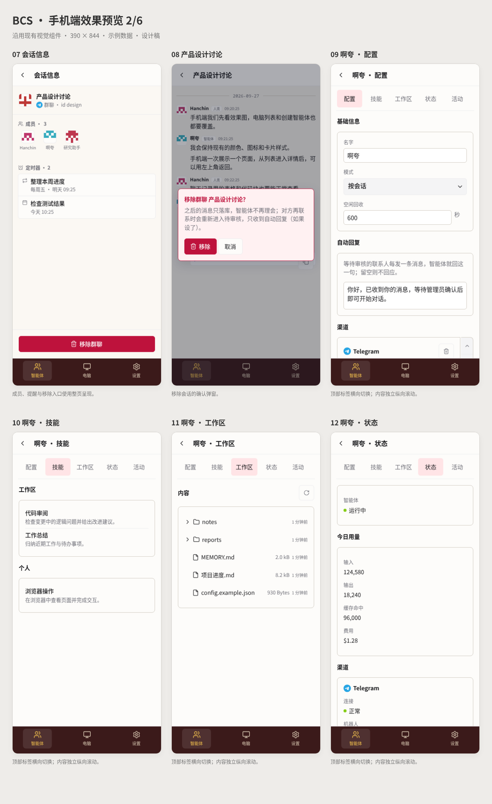
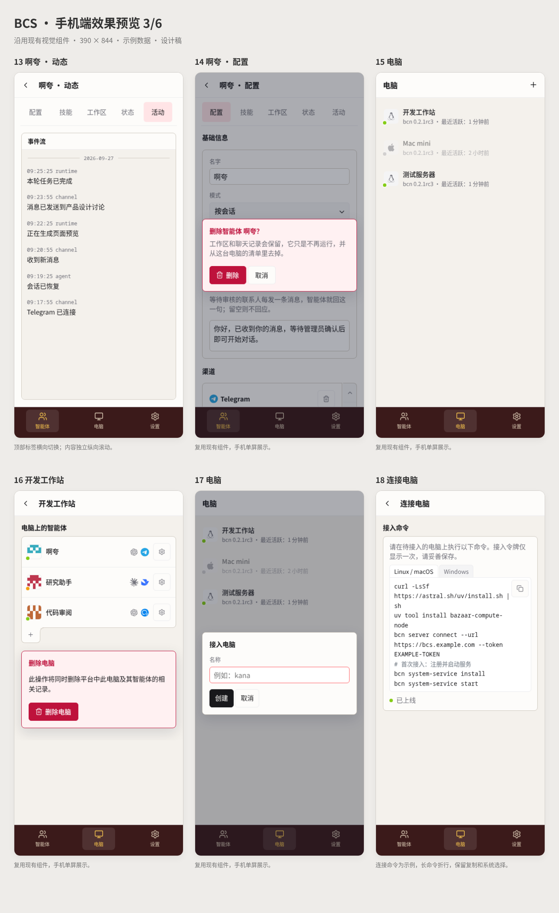
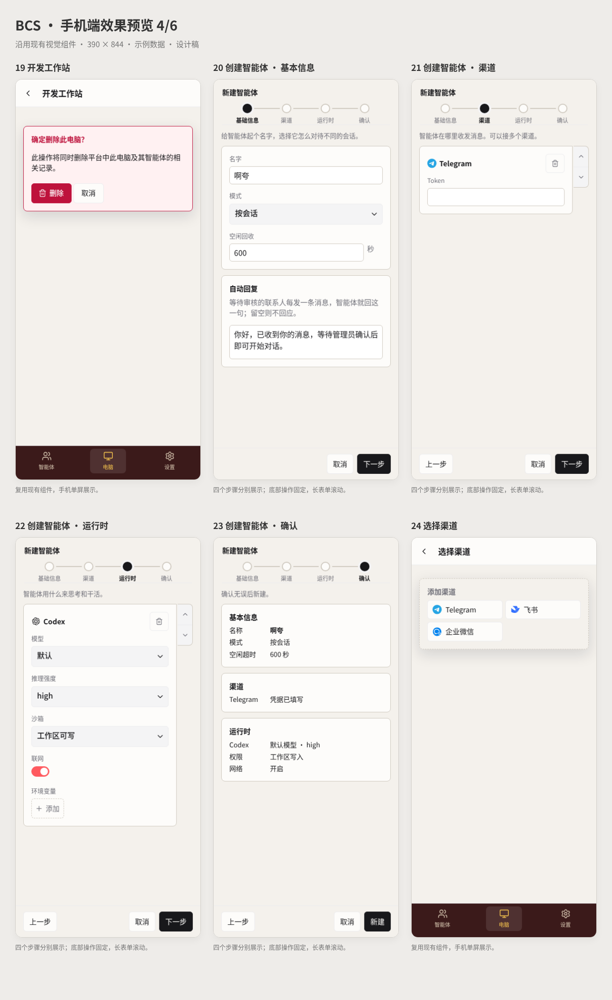
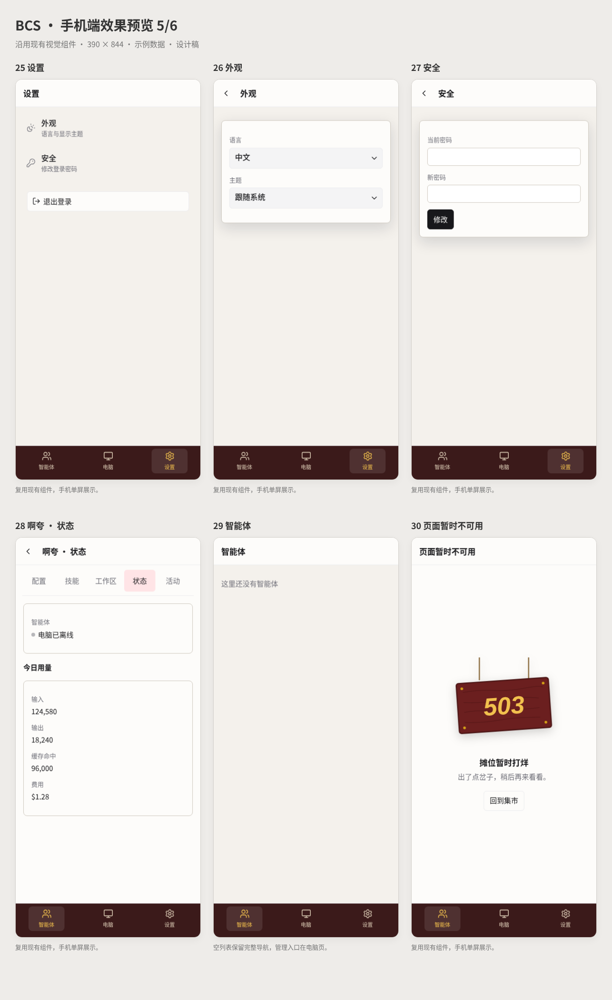
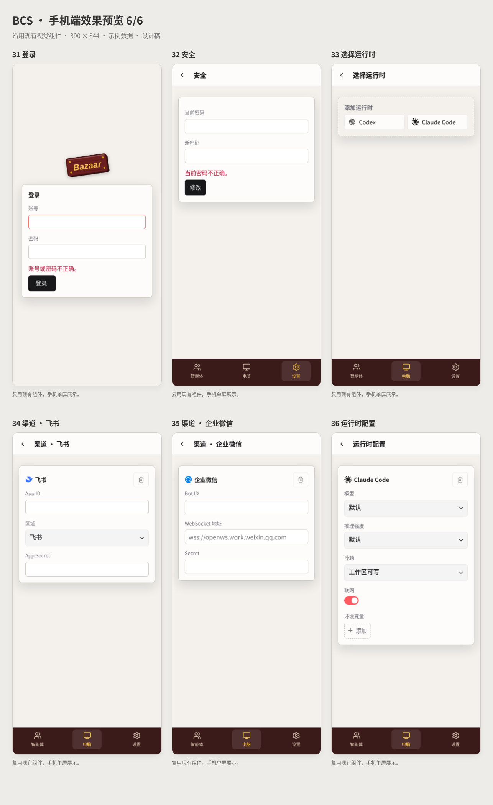
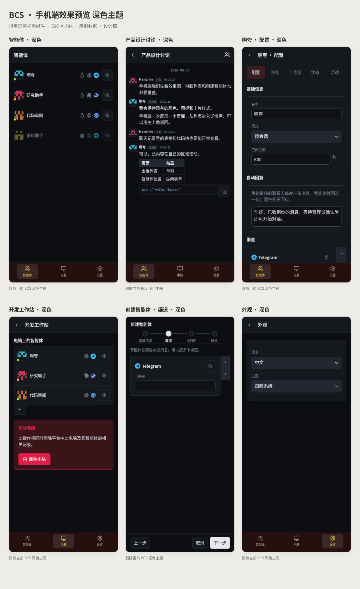

# 手机端效果稿

基于 `4f9a95a9e8516a0164346723c2b5155dd8f9b052` 的 BCS 模板、SVG 图标和样式制作，示例数据。
本目录用于设计审阅，正式实现按 [实施计划](../2026-09-27-bcs-mobile.md) 修改共享组件。

- [离线交互预览](BCS-mobile-preview.html)：下载后用浏览器打开；可切换全部 36 个页面、浅深色和 320/390/430px，滚动查看长表单。表单为演示。
- [逐页 PDF](BCS-mobile-preview.pdf)：36 页，390×844 效果图。
- 下方总览：每张 6 屏；独立截图在 `screens/`。

本版已同步讨论中的两项修订：登录按钮左对齐、紧凑宽度；会话与待审核标签保留原有图标、文字和数量提示。
效果稿中的独立页面用于对比各个状态，正式页面通过同一套模板响应屏幕宽度。

## 全部总览

## 页面索引

| 编号 | 分组 | 页面 |
| --- | --- | --- |
| 01 | 登录与设置 | [登录](screens/01-login.png) |
| 02 | 智能体与会话 | [智能体](screens/02-agents.png) |
| 03 | 智能体与会话 | [啊夸](screens/03-contacts.png) |
| 04 | 智能体与会话 | [啊夸](screens/04-requests.png) |
| 05 | 智能体与会话 | [产品设计讨论](screens/05-chat.png) |
| 06 | 智能体与会话 | [会话审核](screens/06-review.png) |
| 07 | 智能体与会话 | [会话信息](screens/07-contact-profile.png) |
| 08 | 智能体与会话 | [产品设计讨论](screens/08-remove-contact.png) |
| 09 | 智能体详情 | [啊夸 · 配置](screens/09-config.png) |
| 10 | 智能体详情 | [啊夸 · 技能](screens/10-skills.png) |
| 11 | 智能体详情 | [啊夸 · 工作区](screens/11-workspace.png) |
| 12 | 智能体详情 | [啊夸 · 状态](screens/12-status.png) |
| 13 | 智能体详情 | [啊夸 · 动态](screens/13-activity.png) |
| 14 | 智能体详情 | [啊夸 · 配置](screens/14-remove-agent.png) |
| 15 | 电脑管理 | [电脑](screens/15-computers.png) |
| 16 | 电脑管理 | [开发工作站](screens/16-computer.png) |
| 17 | 电脑管理 | [电脑](screens/17-add-computer.png) |
| 18 | 电脑管理 | [连接电脑](screens/18-connect.png) |
| 19 | 电脑管理 | [开发工作站](screens/19-remove-computer.png) |
| 20 | 创建智能体 | [创建智能体 · 基本信息](screens/20-wizard-0.png) |
| 21 | 创建智能体 | [创建智能体 · 渠道](screens/21-wizard-1.png) |
| 22 | 创建智能体 | [创建智能体 · 运行时](screens/22-wizard-2.png) |
| 23 | 创建智能体 | [创建智能体 · 确认](screens/23-wizard-3.png) |
| 24 | 创建智能体 | [选择渠道](screens/24-channel-kinds.png) |
| 25 | 登录与设置 | [设置](screens/25-settings.png) |
| 26 | 登录与设置 | [外观](screens/26-appearance.png) |
| 27 | 登录与设置 | [安全](screens/27-security.png) |
| 28 | 状态与反馈 | [啊夸 · 状态](screens/28-offline.png) |
| 29 | 状态与反馈 | [智能体](screens/29-empty.png) |
| 30 | 状态与反馈 | [页面暂时不可用](screens/30-error.png) |
| 31 | 状态与反馈 | [登录](screens/31-login-error.png) |
| 32 | 状态与反馈 | [安全](screens/32-password-error.png) |
| 33 | 创建智能体 | [选择运行时](screens/33-runtime-kinds.png) |
| 34 | 创建智能体 | [渠道 · 飞书](screens/34-lark.png) |
| 35 | 创建智能体 | [渠道 · 企业微信](screens/35-wecom.png) |
| 36 | 创建智能体 | [运行时配置](screens/36-runtime-config.png) |

## 已完成的设计检查

36 个页面已在浏览器以 320px、390px 宽度检查文档横向溢出；总览和主要深色页面经过视觉检查，PDF 页数为 36。离线预览的页面选择、主题切换及长表单展示已检查。软键盘、安全区、真实接口局部刷新和触摸导航纳入实施验收。
