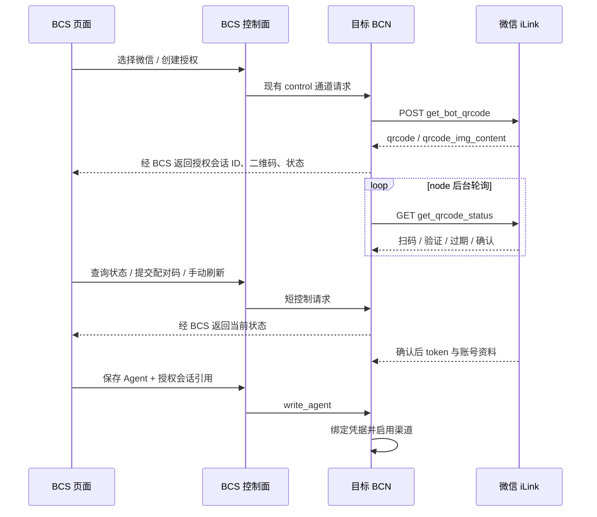

# 微信渠道与 BCS 扫码授权

## 目标与审阅状态

在 BCS 创建和编辑智能体时选择微信，通过扫码完成绑定，并由目标 BCN 节点提供微信私聊、附件与运行状态反馈。选择微信立即生成新二维码；过期后模糊遮罩，由用户点击“刷新”重新生成；已有有效凭据继续复用。

本计划依据 2026-09-26 的源码调研和界面讨论整理，2026-09-27 更新用户确认文案，待云端 review。仓库基线为 `4f9a95a`（v0.2.1rc3）。引用的腾讯源码为 `24de5c9`（package 2.4.9），Python 参考为 `3713743`（0.3.5）。下文的接口、存储及文字审批设计属于待审阅的实施提案。

## 源码核对

| 参考 | 结果及采用方式 |
| --- | --- |
| [Python weixin-ilink](https://github.com/zongrongjin/weixin-ilink/tree/3713743/src/weixin_ilink) | 同步 requests、二维码自动刷新，协议基于 2.1.x。借鉴 Python 字段和 CDN 加解密，协议实现放入 BCN `contrib/wechat`，复用 aiohttp 和现有 cryptography。消息正文沿用 BCN 现有处理链。 |
| [腾讯当前登录源码](https://github.com/Tencent/openclaw-weixin/blob/24de5c9/src/auth/login-qr.ts) | 获取二维码已用 POST；有扫码后数字配对、IDC 跳转和已绑定分支。作为授权字段与状态的直接依据。 |
| [腾讯协议文档](https://github.com/Tencent/openclaw-weixin/blob/24de5c9/docs/protocol_zh_CN.md) | HTTP JSON、getupdates、sendmessage、媒体 CDN、typing，以及启动/停止通知。 |
| [腾讯 token 状态处理](https://github.com/Tencent/openclaw-weixin/blob/24de5c9/src/api/session-guard.ts) | `-14` 表示 stale/expired token；当前官方实现暂停 API 调用一小时。不能把“所有 -14 必须立即重扫”当作官方确定契约。BCN 显示授权异常及重新授权入口，避免高频重试。 |

首次授权仍走二维码流程；数字配对码是其后续状态。官方 displayQRCode 同时输出链接，但源码不能证明所有手机/微信环境均能仅点击链接完成授权，因此本稿采用已确认的扫码交互。有效凭据可复用。

## 页面行为

沿用 `agent_new.html` 的四步向导和 `agent_form.html` 的渠道卡片；编辑 Agent 复用同一微信授权组件。页面字体、底色、步骤指示、按钮来自当前 BCS `app.css`。

1. 选择微信，卡片立即显示加载状态，请 node 创建一次授权会话并取得新的二维码。
2. 等待扫码显示“微信扫一扫，连接智能体”和二维码；`scaned` 显示“请在手机微信上确认连接”。二维码内容按协议字符串编码为图；`qrcode_img_content` 不能仅凭字段名当成 PNG 地址，当前官方直接将它交给 QR 编码器。node 使用 `segno` 将字符串编码为 SVG，BCS 展示。
3. `need_verifycode` 才显示“输入手机显示的数字”，提交后继续同一会话轮询。再次要求时显示数字不匹配；`verify_code_blocked` 显示本轮验证失败及重新开始入口。
4. 收到 `expired` 立即终止该轮轮询，二维码模糊并覆盖“二维码已过期”和“刷新”按钮。用户点击后才生成新二维码，按钮等待期间禁用。旧轮询迟到结果按会话代次丢弃。
5. 过期以服务端状态为准；当前源码的五分钟是本地会话保鲜时间，不是服务端承诺的二维码有效期。BCN 采用五分钟本地等待上限，超时应标“等待已超时”，而不是伪称服务端已过期。页面后台恢复、断网或 node 离线时先遮住不能确认有效的码，重新查询状态；不会挂着旧码让用户继续扫。
6. `confirmed` 显示“微信授权成功”，启用下一步。新 Agent 最终保存后启用收发。取消向导、移除卡片会释放本地授权草稿；已发生的微信端授权不会被伪称已远程撤销。
7. 已保存渠道显示授权状态及重新授权入口。改绑成功并保存后切换到新身份，游标、上下文与去重空间按账号隔离。

界面以现有 BCS Jinja 模板和原始 `app.css` 为准，复用卡片、侧栏、步骤条、图标与浅深色主题；微信授权区只增加局部样式。扫码引导固定为“微信扫一扫，连接智能体”，按钮固定为“刷新”。

## 控制与状态归属

- node 拥有 pending authorization manager，独立于运行中的 Agent，因此新建 Agent 尚无 ID 时也可扫码。草稿以随机 `authorization_id` 识别，绑定目标 computer、操作用户/授权会话及卡片实例；已存在 Agent 另绑定 agent/channel 身份。
- 控制面增加 begin/status/verify/refresh/cancel 这几个有类型的授权操作，复用 `contrib/server/control.py` 已有请求-应答通道；长轮询在 node 后台任务中，BCS 查询只读取快照，页面每两秒查询一次。BCS 重启后可从 node 恢复仍有效的会话。
- `write_agent` 接收授权引用并校验归属，将已确认凭据绑定到最终 Agent 和渠道；保存失败允许同一草稿重试，提交成功消费引用。授权完成到保存采用明确的本地草稿期限（15 分钟），和二维码等待期限分开。编辑已有渠道时保留旧记录直到新绑定提交。
- 持久信息位于 node：bot_token、bot_id、user_id、baseurl、get_updates_buf、会话 context_token；配置只保留 `kind` 与账号引用。通过 node 存储接口及新增 SQLite migration 提供持久化，contrib 不自行打开通用数据库。临时二维码与配对码属于短期会话。
- BCS/浏览器得到二维码、状态、脱敏账号标识和授权引用。原始 token/context_token 不进入 BCS 控制返回或审计事件。授权端点沿用登录、目标计算机写权限和 CSRF 校验，二维码响应禁用缓存。授权引用本身不能替代操作者权限。
- `scaned_but_redirect` 在 node 切换协议返回的合法 HTTPS 微信域名继续查询。`binded_redirect` 仅在能匹配本机现有凭据时恢复已有授权；没有对应凭据时展示需要重新连接的明确提示，不能当成已拿到 token。

## Channel 实现

`contrib/wechat` 提供 plugin / auth / api / channel / media，通过现有 channel entry point 注册。控制层通过窄的授权能力接口调用插件；微信协议分支留在 contrib。当前 `ChannelContext` 未直接提供状态存储，需在 composition/control 边界接入 node 持有的授权与状态服务，不能假设只新增一个 channel.py 就够。

- 接收：`getupdates` 长轮询，将消息映射为 BCN DM；按 bot identity 与 sender 隔离会话。接入现有 durable inbox 去重，定义消息持久接收与游标推进顺序，重启后可重放去重而不丢消息。
- 回复：`sendmessage` 使用相应会话保存的 context_token；正文原样进入平台文本字段，按 provider 限额拆分。请求确认、明确失败、结果未知按现有 delivery contract 记录。当前官方发送函数在 token 缺失时仍可能提交，因此旧讨论的“绝对不能主动发送”过于绝对；可否送达、上下文有效期以真实接口结果为准，不承诺任意时刻主动推送成功。
- 附件：文本、图片、语音、文件、视频按协议 item 类型处理，复用附件落地链；媒体按官方 CDN AES-128-ECB/PKCS#7 实现。服务端附带语音文字可保留，原音频作为附件。媒体上传和下载需按腾讯当前字段验证。
- 状态：实现 getconfig/sendtyping 和启动、停止通知，授权失效在 channel health 展示并允许页面重连。
- 能力：此通道定位扫码人的 1v1 助手；Python 参考明确声明不能入群。当前协议没有交互卡片，建议审批使用带请求标识的文字确认，校验原 sender、会话、时限与一次性决定后进入现有审批链。该审批方式是本稿建议，尚非用户已确认的决定。
- 同一 bot identity 在一个 node 中保持单一消费归属，避免多个 Agent 抢同一 getupdates 游标；跨 node 归属不能靠一台机器的局部校验保证，需在用户迁移账号时明确切换。

## 修改落点

- `src/bazaar_compute_node/contrib/wechat/`：entry point、授权状态机、异步 iLink API、Channel、媒体加解密。
- `src/bazaar_compute_node/core/control.py` 的 `NodeCommands` 与节点装配：提供独立于已启动 Agent 的授权操作，在 `write_agent` 提交授权引用。
- `src/bazaar_compute_node/contrib/server/control.py`：新增有类型的 begin/status/verify/refresh/cancel 请求，经现有 control result 返回快照。
- node 存储接口与 `src/bazaar_compute_node/contrib/sqlite/migrations/`：新增凭据、授权草稿绑定、游标和会话上下文存储；新增 migration 保留已发布迁移历史。
- `src/bazaar_compute_node/core/channel.py` 的 `ChannelContext` 及装配：向渠道提供所需的节点状态服务；协议实现保持在 contrib。
- `src/bazaar_compute_server/`：增加授权控制路由，复用现有计算机权限、登录和 CSRF；模板沿用 `resources/templates/agent_new.html`、`agent_form.html` 与现有组件，新增微信局部模板和翻译。
- `pyproject.toml`：注册 `bazaar_compute_node.channels` 的微信 entry point，加入 QR 编码依赖；HTTP 与媒体密码算法复用 aiohttp、cryptography。

## Tasks

任务串行执行；每完成一个 task，提交该任务并停下等待 review，通过后继续下一项。

### Task 1：授权状态、节点持久化与控制协议

实现 node 授权管理器、有类型控制请求、SQLite 新迁移和插件授权能力接口。会话状态覆盖等待、已扫码、待验证码、确认、过期、超时、验证阻断、取消；刷新推进代次并丢弃旧响应。完成 `write_agent` 绑定、草稿期限与消费语义；编辑改绑保留旧身份到提交成功。配置文件与 SQLite 分属不同写入介质，采用可恢复提交状态：先记录绑定意图，再写配置，最后标记已提交；重试按授权引用恢复同一次绑定，节点启动时核对并恢复未完成提交。

验证：使用隔离节点与真实微信授权接口，验证扫码、验证码（账号触发时）、超时、手动刷新、取消、保存重试、重启恢复和同节点单账号消费归属。真实账号未触发的协议分支记录为未验证。

### Task 2：BCS 微信授权页面

在创建/编辑智能体的真实模板中接入微信卡片、二维码加载、状态查询、配对码提交、手动刷新、授权成功和重连；保存传递授权引用。沿用实际 BCS 样式，落实“微信扫一扫，连接智能体”与“刷新”。处理切换渠道、关闭向导、移除卡片与页面恢复时的会话状态。

验证：浏览器在浅深色主题走完整创建和编辑流程，实际扫码后保存；检查过期遮罩、按钮等待状态、断网恢复和 node 离线提示，并保留实际模板截图供 review。

### Task 3：DM 文本与持久收发

实现 `getupdates`、`sendmessage`、DM identity、context_token 持久化和账号隔离。收到一批消息后，先将消息持久交给现有 inbox 并提交，再推进游标；中途退出通过重拉与 durable 去重恢复。发出消息沿用现有 delivery contract，结果未知时保留未知状态供调用者处理。

验证：真实微信自然对话、连续消息、节点重启续接、授权异常、账号重绑和文本拆分。核对普通用户消息的入站、agent 回复与投递状态。

### Task 4：媒体、typing、审批与交付

完成图片、语音、文件、视频与附件落地，接入 `getconfig/sendtyping`、启动停止通知、channel health 和重连提示。文字审批按本计划提案实现时，将请求标识、原始 sender、会话、有效期限和单次决定绑定到现有审批链。更新 README 渠道支持矩阵及配置说明。

验证：真实微信媒体双向传输、typing、重连与审批往返；provider runtime e2e 使用 TestChannel 控制面注入 inbound、观察输出并处理审批。BCN e2e 使用专用配置、临时数据库和隔离进程。

## 质量检查与验收记录

每个代码 task 完成后运行 Ruff，并在仓库根目录执行 `uv run scripts/pyright_lsp_check.py --outputjson .`。外部依赖采用真实 e2e，按 task 记录已触发的微信状态、实际收发结果与未验证分支。各 task 的 review 以代码、真实流程结果和相关界面截图为依据。
